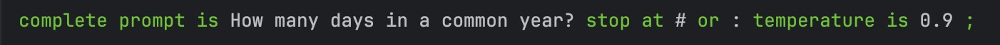
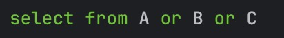
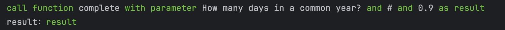
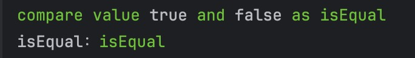
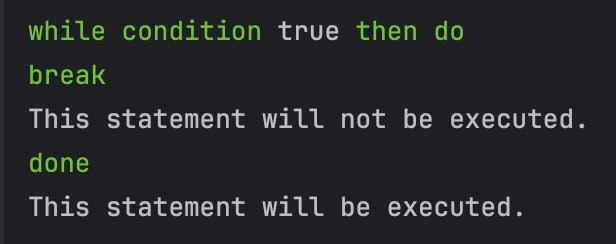
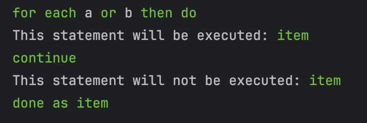
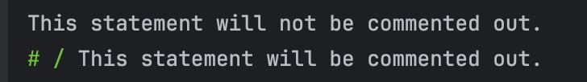
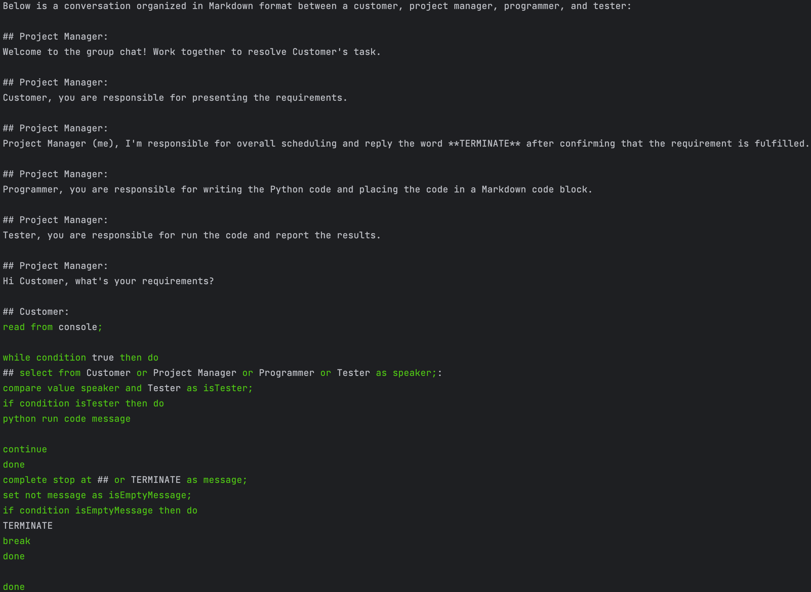

#  PromptLanguage (plang): 一种面向大语言模型(LLM)提示(prompt)的字符串优先编程语言
#  PromptLanguage (plang): a string first-class citizen programming language for Large Language Models (LLMs) prompting

将大语言模型(LLMs)看作一种处理知识（文字）的新型计算机范式，那么它需要一门编程语言。为此，我们设计了PromptLanguage (plang)语言，它是一种字符串为一等公民的面向大语言模型提示工程的编程语言。其核心语法规则遵循：默认解析为字符串、通过字体样式区分字符串与代码（例如：字体颜色），进而实现字符串优先且对任何字符都透明。
该语言具有以下特性：

1. 符合直觉的交互式prompt开发；
2. 运行在LLMs上，自动管理context，与外部API便捷交互；
3. 引导LLMs按照预期行为和格式输出；
4. 面向prompt编程，所想既所得；
5. 面向直观、大型、复杂交互（人、物、环境等）的提示工程；
6. 兼容python生态；

**plang尚不完善，欢迎测试、讨论、提交代码（例如：函数库、模型库、示例库等）。**


[//]: # (new type of general-purpose natural language computer.)

## 安装和测试
### 自动安装
```bash
pip install git+https://github.com/HJZ-XDU/plang.git
```

### 手动安装
#### 克隆库
```bash
git clone https://github.com/HJZ-XDU/plang.git
```

#### 安装环境

```bash
pip install llama_cpp_python regex numpy
```
注意：llama_cpp_python 0.1.79 版本以上支持 gguf 格式，0.1.78 版本以下支持 ggml 格式，请根据自己的模型格式选择版本。

或跳转到 [llama_cpp_python](https://github.com/abetlen/llama-cpp-python) 查看更多信息

### 下载模型

当前支持GGML以及GGUF格式模型，更多模型扩展中

GGML以及GGUF格式模型可在[huggingface.co/TheBloke](https://huggingface.co/TheBloke)下载

### 运行示例代码 
```bash
 $ plang.py [--help] [--model [MODEL]] --path PATH [--nContext [NCONTEXT]] [--lib [LIB ...]] [--verbose] FILE
```
Example
```bash
$ python -u plang.py \
  --model Llama_GGML \
  --path /path/to/model.gguf \
  --lib ./examples/sampleTest/lib.py \
  ./examples/chatbotWithHistoryContext/chatbot.p.backtick.md
```
参数说明：
- `FILE`: plang程序路径。
- `--path, -p`: llm模型文件路径。
-  `--help, -h`(可选): 显示帮助消息并退出。
- `--model, -m`(可选): llm模型名，默认为`Llama_GGML`。
- `--nContext, -n`(可选): llm上下文长度，默认为`2048`。
- `--lib, -l`(可选): 程序中可能用到的库文件，可以指定多个。
- `--verbose, -v`(可选): 启用verbose模式，输出调试信息，默认不启用。

## 快速开始
### 关键字
| 关键字     | 含义     | 备注     |
|---------|--------|--------|
| _样式_    | 标记代码区域 | 暂不支持   |
| as      | 赋值     |        |
| or/and  | 列表     |        |
| ;       | 句尾(可选) | 断句歧义使用 |
| do/done | 代码块    | 元编程    |
| `       | 标记代码区域 | 当前版本   |

### 语法

1. 使用字体样式区分字符串和代码（例如：颜色），当前版本使用一对``` ` ```区分代码，暂对``` ` ```符号不透明；
2. 函数和变量调用为：`函数/变量名 参数键值对`

整体规则如下：
```
[some prompt string]

[`funciton/variableName [parameterName parameterValue] [...] [as variableName] [;]`]

[some prompt string]
```
其中，`[]`表示可选，`...`表示0个或多个。

### 内建函数

<details>

<summary>complete</summary>

#### 函数签名：

```
`complete [prompt is` parameterValue] [`stop at` parameterValue] [`temperature is` parameterValue] 
```

#### 函数说明：

该函数用于使用大语言模型对给定的prompt进行推理，可以自定义推理停止符，以及推理时的temperature参数。

#### 参数说明：

`prompt is`（可选）：用于指定大语言模型的prompt。如果没有该项，大语言模型的prompt将被设置为之前程序中解析出的所有文本。

`stop at`（可选）：设置推理停止符集合。

`temperature is`（可选）：设置大语言模型推理时的temperature参数。

#### 返回值说明：

prompt：模型推理推理结果字符串（prompt返回值会加入程序上下文）

as：模型推理推理结果字符串（as返回值会赋值给as后的变量）

#### 用例说明：
```
`complete prompt is` How many days in a common year? `stop at` # `or` : `temperature is` 0.9 `;`
```
#### 样式化代码：


#### 执行结果：
```
A common year has 365 days.
```
***
</details>

<details>
<summary>select</summary>

#### 函数签名：
```
`select from` parameterValue [`or` parameterValue] […] 
```

#### 函数介绍：

该函数用于规定大语言模型的输出，使大语言模型输出为from后的元素集合中的一个，选择的依据是根据大语言模型推理结果的概率。

#### 参数介绍：

`from`：该参数接受元素的集合。

#### 返回值说明：

prompt：from后的元素集合中概率最大的元素。

as：from后的元素集合中概率最大的元素。

#### 用例说明：
```
`select from` A `or` B `or` C 
```
样式化代码：



执行结果：
```
A
```

***
</details>

<details>
<summary>match</summary>

#### 函数签名：
```
`match regex` parameterValue [`with max token` parameterValue]
```

#### 函数介绍：

该函数用于规定大语言模型的输出，根据正则表达式生成文本。

#### 参数介绍：

`regex`：该参数接受一个正则表达式。

`with max token`：该参数接受一个整数，表示正则表达式的最大匹配长度。

#### 返回值说明：

prompt：大语言模型根据正则表达式生成的文本。

as：大语言模型根据正则表达式生成的文本。

#### 用例说明：
```
`match regex` \(\d{3}\) 555-\d{4,} `with max token` 14 `;`
```
#### 样式化代码：


#### 执行结果：
```
(189) 555-5555
```

***
</details>

<details>
<summary>read</summary>

#### 函数签名：

```
`read from` parameterValue
```

#### 函数介绍：

该函数接受外部输入，目前仅支持来自命令行的输入。

#### 参数介绍：

`from`：该参数接受外部输入的来源，目前仅支持接受console。

#### 返回值说明：

prompt：外部输入的内容。

as：外部输入的内容。

#### 用例说明：
```
`read from` console
```

#### 样式化代码：


#### 执行结果：
```
> hi
hi
```
***
</details>
<details>
<summary>set</summary>

#### 函数签名：

```
`set value/not` parameterValue
```

#### 函数介绍：

使用value时，该函数用于赋值操作，需要与as搭配使用。

使用not时，该函数用于判断parameterValue是否在false列表中。

false列表：`[None, 0, False, 'None', '0', 'False', '', list(), tuple(), dict(), set()]`

#### 参数介绍：

`value`：该参数接受要赋值的值。

`not`：该参数接受一个表达式或变量名，表示要赋值的是否在false列表中。

#### 返回值说明：

prompt：空字符串`''`。

as：使用value时，返回value的值；使用not时，返回true或false。判断的依据是value的值是否在规定的false列表中。

#### 用例说明：
```
`set value` true `as variable`
`set not variable as variable`
variable：`variable`
```
#### 样式化代码：


#### 执行结果：
```
variable：False
```
***

</details>
<details>
<summary>call</summary>

#### 函数签名：

```
`call function` parameterValue [`with parameter` parameterValue [`and` parameterValue] […] ]
```

#### 函数介绍：

通过函数名调用某个函数，必须按照函数的参数顺序传入参数。

#### 参数介绍：

`function`：该参数接受函数名。

`with parameter`：该参数接受函数的参数，可以指定多个，但必须按照函数的参数顺序传入参数。

#### 返回值说明：

prompt：空字符串`''`。

as：被调用函数的返回值。

#### 用例说明：
```
`call function` complete `with parameter` How many days in a common year? `and` # `and` 0.9 `as result`
result：`result`
```

#### 样式化代码：



#### 执行结果：
```
A common year, also known as a non-leap year, has 365 days.
result：
A common year, also known as a non-leap year, has 365 days.
```
***

</details>
<details>
<summary>if</summary>

#### 函数签名：

```
`if condition` parameterValue `then do`
parameterValue(program)
`done`
```

#### 函数介绍：

该函数用于实现if判断语句。是否执行if的依据是condition的值，如果condition的值在false列表中，则不执行if，否则执行if。

false列表：`[None, 0, False, 'None', '0', 'False', '', list(), tuple(), dict(), set()]`

#### 参数介绍：

`condition`：该参数接受一个表达式或变量名，表示循环的条件。

`then`：该参数接受 循环体的代码块，包含了循环执行的操作。

#### 返回值说明：

prompt：空字符串`''`。

as：condition的值。

#### 用例说明：
```
`if condition` true `then do`
This statement will be executed.
`done`
```
样式化代码：


#### 执行结果：
```
This statement will be executed.
```
***
</details>
<details>
<summary>while</summary>

#### 函数签名：

```
`while condition` parameterValue `then do`
parameterValue(program)
`done`
```

#### 函数介绍：

该函数实现了while循环语句的功能。是否执行while的依据是condition的值，如果condition的值在false列表中，则不执行while，否则执行while。

false列表：`[None, 0, False, 'None', '0', 'False', '', list(), tuple(), dict(), set()]`

#### 参数介绍：

`condition`：该参数接受一个表达式或变量名，表示循环的条件。

`then`：该参数接受循环体的代码块，包含了循环执行的操作。

#### 返回值说明：

prompt：空字符串`''`。

as：condition的值。

#### 用例说明：
```
`while condition` true `then do`
executing loop body
`done`
```
#### 样式化代码：


#### 执行结果：
```
executing loop body
executing loop body
executing loop body
...
```
***
</details>

<details>
<summary>for</summary>

#### 函数签名：
```
`for each` parameterValue [`or` parameterValue] […] `then`
parameterValue(program)
`done`
```

#### 函数介绍：

该函数遍历each中的每一个元素，对于每一个元素执行then中循环体的操作。

#### 参数介绍：

`each`：该参数接受要遍历的元素集合

`then`：该参数接受 循环体的代码块，包含了循环执行的操作。

#### 返回值说明：

prompt：空字符串`''`。

as：for中当前遍历的元素。

#### 用例说明：

```
`for each` a `or` b `or` c `then do`
item： `item`
`done as item`
```
#### 样式化代码：


#### 执行结果：
```
item： a
item： b
item： c
```
***
</details>

<details>

<summary>compare</summary>
函数签名:

```
`compare value` parameterValue [`and` parameterValue] […]
```

#### 函数说明：

该函数用于比较value中的元素集合是否全部相同。 

#### 参数说明

`value`：接受用于比较的元素集合。

#### 返回值说明：

prompt：空字符串`''`。

as：若value中的元素集合全部相同，返回true，否则为false。

#### 用例说明：
```
`compare value` true `and` false `as isEqual`
isEqual：`isEqual`
```

#### 样式化代码：



#### 执行结果：
```
isEqual：False
```

***
</details>

<details>

<summary>break</summary>

#### 函数签名：
```
`break`
```

#### 函数介绍：

在循环中使用时，用于跳出循环，无论循环的条件是否满足。

#### 参数介绍：

无

#### 返回值说明：

prompt：空字符串`''`。

as：`'break'`。

#### 用例说明：
```
`while condition` true `then do
break`
This statement will not be executed.
`done`
This statement will be executed.
```
#### 样式化代码：



#### 执行结果：
```
This statement will be executed.
```
***
</details>

<details>
<summary>continue</summary>

#### 函数签名：

```
`continue` 
```

#### 函数介绍：

实现continue语句，主要用于循环结构，通常在满足某些条件时，希望跳过当前迭代，直接执行下一次迭代。

#### 参数介绍：

无

#### 返回值说明：

prompt：空字符串`''`。

as：`'continue'`。

#### 用例说明：
```
`for each` a `or` b `then do`
This statement will be executed: `item`
`continue`
This statement will not be executed: `item`
`done as item`
```

#### 样式化代码：



执行结果：
```
This statement will be executed: a
This statement will be executed: b
```
***
</details>

<details>

<summary>comment</summary>

#### 函数签名：

```
`# /` variableValue
```

#### 函数介绍：

该函数用于注释，

#### 参数介绍：

`/` ：该参数接受的值将被注释。

#### 返回值说明：

prompt：空字符串`''`。

as: 无返回值，即`None`。

#### 用例说明：
```
This statement will not be commented out.
`# /` This statement will be commented out.
```
#### 样式化代码：



#### 执行结果：
```
This statement will not be commented out.
```
***
</details>

## 示例
### 聊天机器人
描述：8行代码实现支持历史记录上下文的聊天机器人。

代码：
```
`while condition` true `then do`
## USER:
`read from` console`;`

## ASSISTANT:
`complete stop at` # `or` : `temperature is` 0.9`;`

`done`
```
样式化代码：


命令行启动语句：
```
$ python plang.py \
  --model Llama_GGML \
  --path /path/to/model.gguf \
  ./examples/chatbotWithHistoryContext/chatbot.p.backtick.md
```

执行结果：
```
## USER:
> 你好，我叫Tony
你好，我叫Tony

## ASSISTANT:
您好，欢迎来到我的世界！有什么我可以帮助您的吗？

## USER:
> 请问你知道我的名字叫什么吗？
请问你知道我的名字叫什么吗？

## ASSISTANT:
是的，我知道。你的名字叫做Tony。

## USER:
> 
```
### ReAct工具调用
描述：访问plangSearchTool工具，回答有关plang的问题

代码：
```
Answer the following questions as best you can. You have access to the following tools:

plangSearchTool: Useful for when you need to answer questions about plang. The input parameter are search keywords.
FinalAnswerTool: Useful for when you need to report the final answer or don't need a tool.

Use the following format:

Question: the input question you must answer
Thought: you should always think about what to do
Action: the action to take, should be one of [plangSearchTool, FinalAnswerTool]
Action Input: the input to the action
Observation: the result of the action
... (this Thought/Action/Action Input/Observation can repeat N times)
Thought: I now know the final answer.
Action: FinalAnswerTool
Final Answer: the final answer to the original input question

Begin!

`while condition` true `then do`
Question: `read from` console`;`
`while condition` true `then do`
Thought:`complete stop at` Action`;`
Action: `select from` plangSearchTool `or` FinalAnswerTool `as nameTool;`
`compare value nameTool and` FinalAnswerTool `as isFinalAnswerTool;`
`if condition isFinalAnswerTool then do
break
done`
Action Input:`complete stop at` Observation `as parameterTool;`
Observation: `call function nameTool with parameter parameterTool;`
`done`
Final Answer:`complete stop at` Question`;`

`done`
```
样式化代码：


命令行启动语句：
```
$ python plang.py \
  --model Llama_GGML \
  --path /path/to/model.gguf \
  --lib ./examples/ReAct/lib.py \
  ./examples/ReAct/react.p.backtick.md
```

执行结果
```
Answer the following questions as best you can. You have access to the following tools:

plangSearchTool: Useful for when you need to answer questions about plang. The input parameter are search keywords.
FinalAnswerTool: Useful for when you need to report the final answer or don't need a tool.

Use the following format:

Question: the input question you must answer
Thought: you should always think about what to do
Action: the action to take, should be one of [plangSearchTool, FinalAnswerTool]
Action Input: the input to the action
Observation: the result of the action
... (this Thought/Action/Action Input/Observation can repeat N times)
Thought: I now know the final answer.
Action: FinalAnswerTool
Final Answer: the final answer to the original input question

Begin!

Question: > What is plang?
What is plang?
Thought: I need to find out what plang is, so I will use plangSearchTool.
Action: plangSearchTool
Action Input: plang
Observation: {"keyword": "plang", "result": "PromptLanguage (plang): a string first-class citizen programming language for Large Language Models (LLMs) prompting"}
Thought: I now know the final answer.
Action: FinalAnswerTool
Final Answer: plang is a string first-class citizen programming language for Large Language Models (LLMs) prompting.

Question: > 
```

### miniAutoGen
描述：多Agent自组织发言、写代码、执行代码来完成用户指令

代码：
```
Below is a conversation organized in Markdown format between a customer, project manager, programmer, and tester:

## Project Manager:
Welcome to the group chat! Work together to resolve Customer's task.

## Project Manager:
Customer, you are responsible for presenting the requirements.

## Project Manager:
Project Manager (me), I'm responsible for overall scheduling and reply the word **TERMINATE** after confirming that the requirement is fulfilled.

## Project Manager:
Programmer, you are responsible for writing the Python code and placing the code in a Markdown code block.

## Project Manager:
Tester, you are responsible for run the code and report the results.

## Project Manager:
Hi Customer, what's your requirements?

## Customer:
`read from` console`;`

`while condition` true `then do`
## `select from` Customer `or` Project Manager `or` Programmer `or` Tester `as speaker;`:
`compare value speaker and` Tester `as isTester;`
`if condition isTester then do
python run code message`

`continue
done`
`complete stop at` ## `or` TERMINATE `as message;`
`set not message as isEmptyMessage;`
`if condition isEmptyMessage then do`
TERMINATE
`break
done`

`done`
```
样式化代码：



命令行启动语句：
```
$ python plang.py \
  --model Llama_GGML \
  --path /path/to/model.gguf \
  --lib ./examples/miniAutoGen/lib.py \
  ./examples/miniAutoGen/miniAutoGen.p.backtick.md
```
执行结果：
```
Below is a conversation organized in Markdown format between a customer, project manager, programmer, and tester:

## Project Manager:
Welcome to the group chat! Work together to resolve Customer's task.

## Project Manager:
Customer, you are responsible for presenting the requirements.

## Project Manager:
Project Manager (me), I'm responsible for overall scheduling and reply the word **TERMINATE** after confirming that the requirement is fulfilled.

## Project Manager:
Programmer, you are responsible for writing the Python code and placing the code in a Markdown code block.

## Project Manager:
Tester, you are responsible for run the code and report the results.

## Project Manager:
Hi Customer, what's your requirements?

## Customer:
> Calculating prime numbers between 0 and 10.
Calculating prime numbers between 0 and 10.

## Programmer:
Here is the Python code to calculate prime numbers between 0 and 10:

```python
def is_prime(n):
    if n <= 1:
        return False
    for i in range(2, int(n ** 0.5) + 1):
        if n % i == 0:
            return False
    return True

numbers = [i for i in range(11)]
prime_numbers = [i for i in numbers if is_prime(i)]
print(prime_numbers)
`` ` 

## Tester:
The Python interpreter returns: {"stdout": "[2, 3, 5, 7]\n", "stderr": ""}

## Project Manager:
Great job! Customer, your requirement is fulfilled. 

## Project Manager:
TERMINATE
```

### 更多
见./examples目录：
```
cd ./examples
ls
```

## TODOs
* [ ] 完善已有函数功能 (./libLang/)
* [ ] 添加更多函数 (./libLang/)
    * [x] 按照正则表达式生成文本 (./libLang/fill.py 注册参数为："fill", ["regex", ]) // 注："fill" -> "match"
* [ ] 添加更多示例 (./examples/)
* [ ] 支持更多模型格式 (./libLLM/)
* [ ] 建立贡献目录 (./contribution/)
* [ ] 完善开发和贡献文档 (./readme.md、./contribution.md)
* [ ] 已知Bug
    * [ ] 参数名与函数名相同时，会将参数名解析为函数名
    * [ ] 名字前缀相同时，会按照最短前缀名字解析

## 相关工作 (prompting技术)
- 字符串模板型
  - 自然语言文本
  - 穿插“占位符”的文本
- API编程型
  - 代码编程
    - LangChain: https://github.com/langchain-ai/langchain
    - Semantic Kernel: https://github.com/microsoft/semantic-kernel
    - MiniChain: https://github.com/srush/MiniChain
    - AutoGen: https://github.com/microsoft/autogen
    - CrewAI: https://github.com/joaomdmoura/crewAI
  - 图形编程
    - Langflow: https://github.com/logspace-ai/langflow
    - Flowise: https://github.com/FlowiseAI/Flowise
    - Prompt flow: https://github.com/microsoft/promptflow
  - 配置文件
    - Guardrails: https://github.com/guardrails-ai/guardrails
    - NeMo Guardrails: https://github.com/NVIDIA/NeMo-Guardrails
- 在程序中嵌入prompt型
  - guidance: https://github.com/guidance-ai/guidance
  - LMQL: https://github.com/eth-sri/lmql
  - SGLang: https://github.com/sgl-project/sglang
  - LCEL (LangChain): https://python.langchain.com/docs/expression_language/
  - Marvin: https://github.com/PrefectHQ/marvin
  - TypeChat: https://github.com/microsoft/TypeChat
- 在prompt中嵌入程序型
  - PromptLanguage (plang) [ours]: https://github.com/HJZ-XDU/plang

## 鸣谢项目
- llama-cpp-python：https://github.com/abetlen/llama-cpp-python